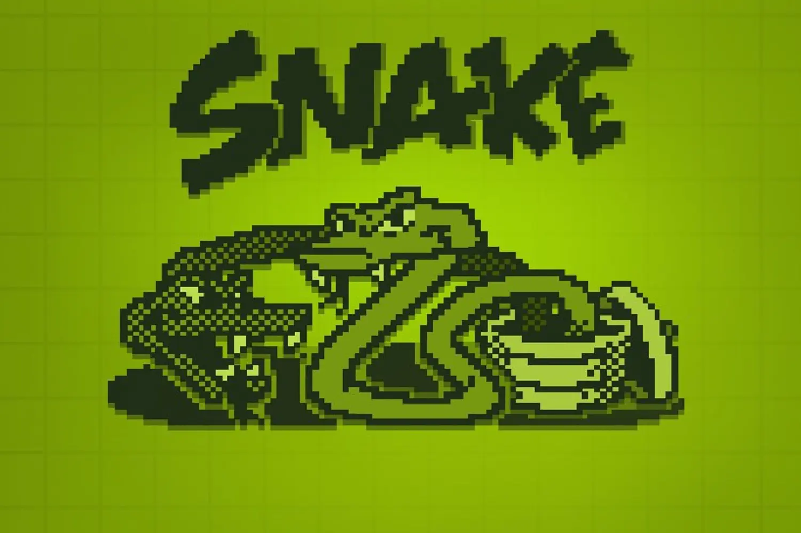
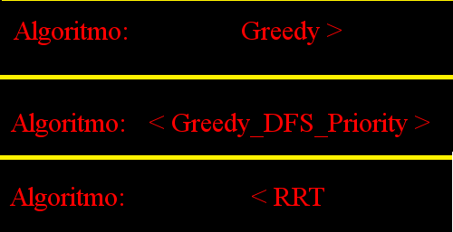
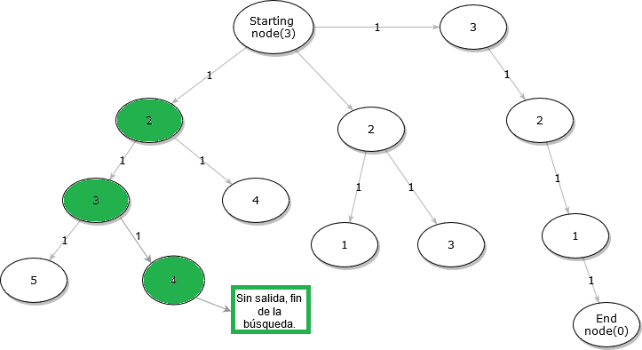
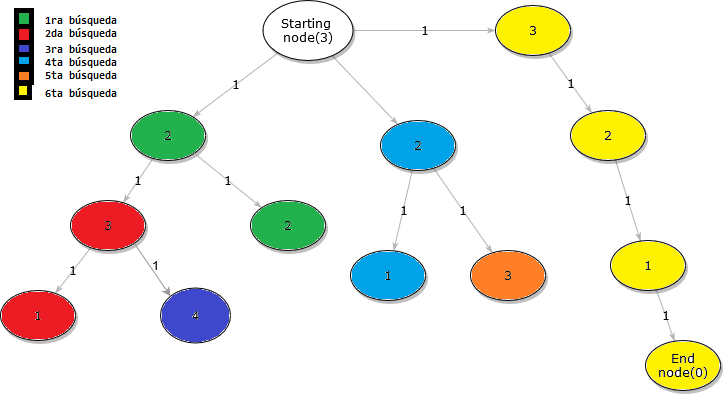
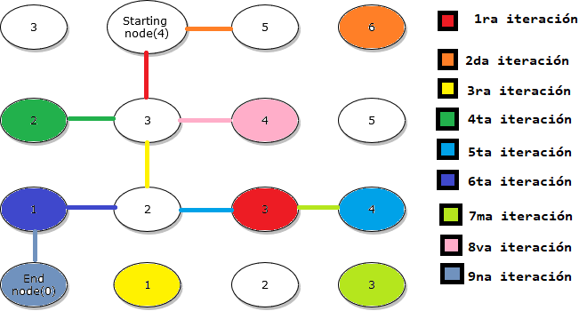

# Snake-IA



Juego Snake con agente que ejecuta algoritmos de búsqueda.

* Escrito en python
* Greedy
* Greedy DFS con cola de prioridad
* RRT


## Instalación

* Descargar python3 desde la [página oficial](https://www.python.org/downloads/).

* Descargar biblioteca `pygame` por medio de `pip` en la terminal.

```
pip3 install pygame
```

## Ejecutar aplicación
Descargar el código desde el repositorio y correr el archivo como cualquier otro script python.
```
python Snake_Game.py
```

## Botones y configuraciones


En la pantalla de inicio(Menú principal), podemos seleccionar entre jugar o iniciar la simulación con nuestro agente ejecutando los algoritmos de búsqueda.


Para elegir un algoritmo para nuestro agente, debemos iniciar la simulación seleccionando `simulación` en el menú principal y luego presionar `Espacio` para pausar y elegir el algoritmo a gusto.

Por defecto viene `Greedy_Priority`



Basta con presionar `Espacio` nuevamente para volver a la simulación y que nuestro agente ajecute en su próxima búsqueda el algoritmo seleccionado.

## Algoritmos y agente
Desde la `línea 376` se puede encontrar la clase agente la cual contiene los métodos con los algoritmos de búsqueda.

## Greedy clásico
Elige el nodo inmediatamente menos costoso en cada iteración. Si no llega a su objetivo con su actual ruta(atrapado) finaliza la búsqueda.



## Greedy DFS con prioridad
Elige el nodo inmediatamente menos costoso del punto de vista de la `Distancia euclidiana` y recorre ese camino siguiendo la misma lógica. Si no encuentra un camino en la ruta actual, es decir no hay más nodos, retrocede al nodo anterior y sigue la búsqueda en el siguiente nodo más barato(guardado en la cola de prioridad) que se enlaza al de la pocisión actual, viendolo de esta forma tiene una similitud con `DFS`(Depth First Search), ya que analiza los caminos a profundidad en cada búsqueda. **El costo de los enlaces no está contemplado en la heurística**. Si no encuentra ruta posible(atrapado), llama a `Greedy clásico` para despejar una posible salida, si esto no sucede finaliza la búsqueda, en otro caso se ejecuta el algoritmo nuevamente tomando como punto inicial el último nodo recorrido con `Greedy clásico`.




Cada nodo tiene 4 enlaces posibles, si de alguna manera el costo hacia el objetivo fuera el mismo para las 4 posiciones(o las que esten disponibles, es decir no hay obstaculos) el orden de elección para la selección del proximo nodo está dada por `Up, Down, Left, Right`.

El grafo al tratarse de un espacio abierto como lo es el escenario de Snake hay muchas formas de llegar a un mismo nodo. Para evitar los bucles infinitos se añade una lista con los nodos a los que ya se les analizaron todas las rutas y ninguna daba al objetivo, esta lista se llama `Visited`. Además se consideran como obstaculo(Nodo inalcanzable) el cuerpo de la serpiente, los límites de la pantalla y la ruta o grafo obtenido hasta ese momento en el algoritmo. 

Ejemplos:
* Si A me lleva a B, B me lleva a C y C me lleva a A y D, el único nodo disponible en esa ruta es D ya que A forma parte de mi ruta hasta ese punto

* Si la rama C -> (D y E -> F) no llega a mi objetivo, como ya revisamos todos los nodos disponibles en E, E se agrega a `Visited`, los mismo con D la cual no tiene nodos disponibles y C la cual se acaba de revisar por completo. Al momento de llegar a una ruta A -> (B->C y H->(A y E)) tenemos que B tiene un enlace con C pero como está en visited es inalcanzable. Por otro lado H tiene A y E, E está en visited por lo tanto es inalcanzable y A es parte de la ruta por lo tanto es inalcanzable. Digamos que A es nuestro nodo inicial y de todas sus rutas ninguna llega al objetivo y estan totalmente revisadas, es decir sus nodos estan en `Visited` por lo tanto nuestro algoritmo como último recurso llamará a `Greedy clásico` para que siga el camino que le paresca inmediatamente menos costoso y cuando no encuentre salida se ejecute la ruta que calculó hasta ese nodo, muchas veces esto despeja una vía para que `Greedy DFS con prioridad` al recalcular el nuevo ambiente encuentre una posible ruta al objetivo, en el caso contrario la serpiente choca consigo misma.

[Greedy DFS con cola de prioridad en acción](https://www.youtube.com/watch?v=Wb_aUWTxIuA)

## RRT (Rapidly-exploring Random Tree)
A partir de un nodo inicial, la ubicación del objetivo y una ubicación aleatoria que cambia en cada iteración se comienza a ramificar el grafo como si las raices de un arbol fuese. Luego de generar el punto aleatorio, el grafo busca su nodo más cercano a este punto y se expande al nodo adyacente más cercano a este, esto se repite en cada iteración teniendo cada vez más probabilidad de que el punto se genere en zonas poco pobladas. Finalmente el algoritmo termina cuando un nodo es expandido a la ubicación de nuestro objetivo. Siendo este el único camino al objetivo, al aplicar `Greedy DFS con prioridad` este recorre el grafo y lo encuentra sin problemas en un tiempo de computo casi instantaneo.



<h3>Problema y solucion en RRT</h3>

**Problema:** El problema que se presentó en RRT una vez implementado fue que el tiempo de computo para encontrar el nodo más cercano al punto generado aleatoriamente se incrementaba a medida que crecia el árbol. Luego de los 1000 nodos añadidos, el tiempo para encontrar el nodo más cercano comienza a disminuir drásticamente demorando incluso varios segundos o minutos en ramificar hasta el objetivo.

**Solución a implementar:** Generar vecindarios dentro del mapa del simulador. El mapa tiene un tamaño de `720x480` pixeles siendo cada nodo de `10x10`, se podrían establecer vecindarios de `90x60` pixeles, es decir particionar el mapa en `8x8` secciones. Esto permitiría solo iterarar entre los nodos del árbol que esten dentro de la vecindad donde se encuentra el punto aleatorio(`54-1` nodos como máximo), si no se encuentra ningún nodo en esa vecindad entonces la búsqueda se expande a las vecindades que la rodean, es decir de 1 vecindad pasamos a `9-1`, ya que sería un cuadrado de `3x3` vecindades sin la central en la cual ya se realizó la búsqueda, si aún no se encuentran nodos en aquellos vecindarios se sigue iterando expandiendo la búsqueda a un cuadrado de `5x5`, añadiendo 16 nodos y solo realizando la búsqueda en los 16 de la periferia.


En la primera iteración solo exite el primer nodo del árbol, el cuerpo de la serpiente(obstáculos) y el punto generado aleatoriamente en un lugar donde no existan nodos ni obstáculos. Al revisar los nodos pertenecientes al `vecindario 35`(donde se encuentra el punto), podemos notar que no hay nodos del árbol y procedemos a expandir el vecindario de búsqueda a `3x3` y buscamos los nodos pertenecientes a los vecindarios de la periferia. Al no encontrar nada aún se vuelve a expandir la zona de búsqueda a `5x5`, luego a `7x7` el cual es restringido por el tamaño máximo del mapa y luego ocurre lo mismo con uno de `9x9` y finalmente encontramos un nodo del árbol(el único en este caso) y procedemos a comparar entre los nodos encontrados cual está más cerca, como este es el único se elige y luego se procede a determinar cual nodo adyancente a este está más cerca del punto aleatorio, se expande y se añade al grafo. Ahora nuestro árbol tiene 2 nodos y el procedimiento se repite hasta expandir una rama a nuestro objetivo. Notese que cuando el árbol tiene más de 500 nodos el método cada vez menos necesita expandir la búsqueda a vecindarios cercanos.

**Esto último no está implementado por cuestión de tiempo, pero en el futuro espero tenerlo listo y funcional. Si quiere ver como se comporta el algoritmo RRT en este momento le advierto que tendrá que disponer de mucho tiempo, ya que funciona pero toma un buen puñado de segundos en ramificar el árbol y dar con el objetivo.**


## Gracias a

* [Snake simple, código base](https://github.com/rajatdiptabiswas/snake-pygame)
